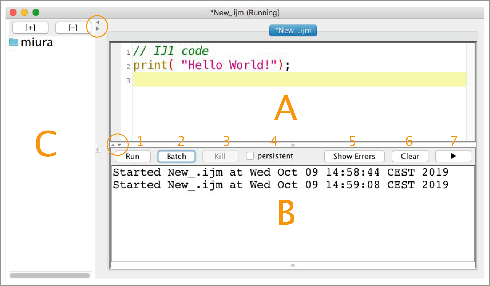
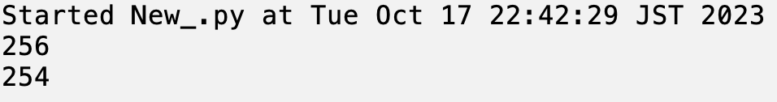

# Jythonの基礎

三浦耕太

last update:2023.10.18 「ImageJではじめる生物画像解析」のサポートサイトに掲載したかなりラフな解説を大幅にアップデートして、GitHubに移植しました。なお、この解説は2012年頃の「少数性生物学」のワークショップに向けて用意した講習が最初のバージョンになります。当時、機会を作っていただいた大阪大学産業科学研究所の永井健治さんにここに感謝します。

GitHubではコードの行番号が表示されません。コード番号をみながら参照するには、同じフォルダにある、PDFを見てください。

## 序論

ImageJには独自のマクロ言語が実装されており、多くの作業はマクロで記述可能である。とはいえImageJのマクロはGUIを経由したスクリプトであるため、ヘッドレス（GUIなし）で使用する際にはさまざまな制限が生じる。また、マクロの関数が用意されていないプラグインを使う場合などに不自由を感じることがある。これらの問題があるときにはJavaの仕様（APIと呼ばれる）に直接アクセスできるスクリプト言語を使う必要がある。

ImageJにおけるスクリプティング言語としては他にGroovy、Jython (Javaで実装したPython)、Javascript(Rhino)、BeanShellなどがある。処理速度を高めたいならば、ClojureもしくはScalaを使うが、2023年現在、これらを使っている人は稀である。型を正確に記述したいならGroovyがお勧めである。JavascriptはFijiではなくともImageJでそのまま使うことが出来る。また、Javascriptはコマンドレコーダの記録言語としても実装されており、マクロと同じように記述することができる。ただしこの場合の運用は、マクロと同程度の機能に限られるので、Javadocを駆使しながらコーディングを行うのでないならば（Javadocについては後述する）マクロでプログラムを書くことをお勧めする。

JythonはPythonの文法であること、Jython自体に実装されているPython由来のさまざまな便利な機能があることから（特に文字列操作、ファイルシステムへのIOにおいてさまざまなメリットがある）、Jythonを使う研究者が多い。また、昨今では（2023年10月の時点で）、Pythonの環境で作動するnapariにPyImageJというプラグインが公開されており、ImageJが作動しているJavaの環境で提供されている膨大な数のプラグインを、napariで使うことができるようになっている。このPyImageJを使う上で、ImageJをライブラリとして使う知識は必須なる。つまり、JythonでFijiを扱う手法を学べば、napariでPyImageJを使うことを学ぶことにもなる。これができれば、歴史的に蓄積されたImageJのプラグインと、Pythonのさまざまなライブラリを同時に使うことが可能になるのである。

pyimagej · PyPI
https://pypi.org/project/pyimagej/

ImageJではJythonのファイルを実行した時にJythonのライブラリが存在しないことがわかると、ImageJはJythonのライブラリを自動的にダウンロードする。一方、Fijiでは最初からJythonが導入されている。以下ではFijiを使っていることを前提に説明をすすめる。理由は、コードを書いて実行する上できわめて優れた機能をもつエディタ（Script Editor）がFijiには付属しているからである。

こうしたことからここではJythonによるスクリプティングを解説する。ImageJのさまざまなクラス群（ImageJはそれぞれ特定の機能をもつJavaでプログラムされたクラスが複数集まった存在であると考えると良い）を扱うには、クラス群の諸機能を参照するためのレファレンスが必要になる。Javadocと呼ばれる仕様書（ImageJの場合にはImageJのJavadoc）がこれにあたり、プログラミングの基本を習得したあとはJavadocを繰りながらスクリプトを書くことになる。ImageJのJavadocは次のリンク先にある。Javadocを読み解くには一定の知識が必要になるが、これは、以下の解説で実際のコードを書き、実行しながら、少しずつ学んでいけるようにするつもりである。

[http://imagej.net/developer/api/](http://www.google.com/url?q=http%3A%2F%2Fimagej.net%2Fdeveloper%2Fapi%2F&sa=D&sntz=1&usg=AOvVaw1v6xdkr40Dui8Lv76D9sT6)


## 参照になるページ


英語になるが、Jythonそのものに関しては、

[The Definitive Guide to Jython](https://jython.readthedocs.io/en/latest/)

が参考になる。2010年のバージョン、となっているが、実際には2019年にもアップデートされている内容である。以下のリンクは、今後JythonでImageJ/Fijiのスクリプティングを行う際に参考になるページである。

[Jython Tutorial @ Fiji wiki](https://imagej.net/scripting/jython/)

[Jython Cookbook @ CMCI](http://wiki.cmci.info/documents/120206pyip_cooking/python_imagej_cookbook)

## はじめの一歩

### スクリプトエディタの使い方

スクリプトエディタ(Script Editor)はFijiのメニューで

\[File > New > Script...\]

を選ぶことで開始できる。

スクリプトエディタには独自のメニューがついている。そのうちの一つが'language'であり、この項目をクリックして、'Python'を選ぶことで、Jythonのコマンドを解釈させることができるようになる。

エディタの右側は上下ふたつのパネルにわかれており、上がスクリプトを入力するテキストフィールドのパネル（図1A）、下が出力フィールドのパネルになっている（図1B）。左のサイドバーは、よく使うフォルダなどを登録することができるファイルへのアクセスのためのパネルになっている(図1C)。右の上下のパネルの間にはRunボタンが左側に（図1-1）、右側にはStdout（通常の出力、図1-5）とStderr（エラー出力）の二種を切り替えるボタンがある。デフォルトでは通常の出力が表示される。なお、英文になるが、[Script Editorの機能を詳しく解説した拙文があるので、興味のある方はそちらを参照](https://www.google.com/url?q=https%3A%2F%2Fanalyticalscience.wiley.com%2Fdo%2F10.1002%2Fwas.000400045&sa=D&sntz=1&usg=AOvVaw2kl56H_AZ7lNX7Gl8KfYU8)に。）



図１　スクリプトエディターの構成。


### Hello World

スクリプトエディタのテキストフィールド（図1A）に以下のように入力する。
```python
print("Hello World!")
```
左下にある'Run'ボタンをクリックすると、下側の出力フィールドに
```python
Hello World!
```
と表示されるはずである。この場合、出力先はスクリプトエディタである。`print`はJythonのコマンドであり、そのあとのカッコの中の文字列ないしは数字を通常出力先（Stdout）出力せよ、というコマンドである。

出力先をImageJのログウィンドウにしたい場合は
```python
from ij import IJ
IJ.log("Hello World!")
```
とする。先程の`print`の場合とことなり、`IJ.log`というコマンドのあとに出力される文字が括弧で囲まれている。IJ.logというコマンドについての詳細は後述する。また、最初に`from x import y`という一行があるが、これは日本語で「インポート文」としばしばよばれる。IJ.logというコマンドを使えるように明示的に「輸入＝import」するのがこの行である。これについてもあとで詳しく述べる。

さらにコマンドを付け加えてみよう。
```python
from ij import IJ
IJ.log("Hello World!")
IJ.log("\\Clear")
```
なおバックスラッシュ(`\`)は日本語のOS環境では、円記号（`¥`）として表示される。機能的には同等の役割を果たす。

この3行のコードを実行（Runをクリックすること）すると、ログウィンドウにはなにも表示されない。2行目と3行目を入れ替えてみる。

```python
from ij import IJ
IJ.log("\\\Clear")
IJ.log("Hello World!")
```

この場合には、`Hello World`が表示される。`\\\Clear`は最初にバックスラッシュが２つ連続して存在することによって、テキストそのものではなく、一種のコマンドを意味することになる（\\\はエスケープシークエンスと呼ばれる）。`\\\Clear`はログウィンドウをクリアしてまっさらにせよ、というコマンドである。

上の3行のコマンドの２つの例における出力の差がプログラミングの本質である。すなわち、コマンドは上から下にむかって次々に実行される。したがってどのような順番でコマンドが書かれているか、ということが出力の内容を決定する。

ここまで説明して、「`IJ`はインポートしたのに、`print`はインポートしないのか」と思われる方もいるかもしれない。なぜインポートしないのか、というと、`print`は組み込み関数といって、わざわざインポートしなくても最初から使えるようになっている。その意味では`from`や`import`も組み込み関数であるが、この場合は特に「関数 function」ではなく「宣言 declaration」と呼ばれる。

## 変数の扱い
さて、次の一行を入力して実行してみよう。
```python
print(1 + 2)
```

出力パネルに
```
3
```
と表示されるはずである。これは、`print`コマンドに続くカッコの中の数式を、数字として計算した後にその結果がプリントされている。次のように書き換えて実行してみよう。
```python
a = 1
b = 2
c = a + b
print(c)
```
出力パネルには先ほどと同じく`３`が表示されるはずである。ただしこの場合、最初に変数`a`に1が代入され、次に`b`に2が代入され、３行目ではこれらの変数を使って加算が行われその結果が変数`c`に代入されている。最後の行ではこの変数`c`がコマンド`print`に渡されて、`c`が保持している値が出力される。

**演習**：`a`の値、`b`の値を別の数に変えて、出力結果が変わることを確かめよ。

以上は数字である。変数には数字ではなく、文字列を代入することもできる。
``` python
a = "Hello"
b = " World"
c = a + b
print(c)
```
出力は`Hello World`となっているはずである。ここで注意して欲しいのは三行目の“数式”である。ここではプラスのサインが`a`と`b`の間にあるが、起こることは算数の足し算ではない。`a`の文字列の後に`b`が追加される(concatenateという)。`Hello`と`world`の数学的な足し算がなにを結果するのかはわからないが、普通そのような足し算はしない。そこで、スクリプトを解釈しているJythonインタプリタ（解釈機能）は、変数が保持している値が数字であるか文字列であるかを分別してプラスサインがなにを実行するのかを切り替えていることがわかる。

文字列であることは、ダブルクオートで文字を囲むことによって明示している。このことから次のようなこともできる。
```python
a = "1"
b = "2"
c = a + b
print(c)
```
この出力結果は
```
12
```
となる。なぜならば、数字の1と2がそれぞれダブルクォートで囲まれているため、ナマの数字ではなく文字列の数字として変数に格納されることになるから、三行目のプラスサインは算数ではなく文字列の追加として機能することになるからである。なお、文字列を囲むのはダブルクオートではなくシングルクオート（` ' `）であっても機能する。

さて、少々ここから発展させる。変数には、数字や文字列のみならず、画像などのより複雑な形式のオブジェクトを代入し、そのオブジェクトを保持させることができる（オブジェクトは文字通り「モノ」とおもっていただければよい。あるいは「ブツ」でもよい）。たとえば、であるが、
```python
from ij import IJ
imp = IJ.openImage('/Users/miura/image.tif')
```
としたときには、impという変数に画像が与えられている。impを画像だ、と思って以降のスクリプトをしたためることになる。たとえばこれに続き
```python
imp.show()
```
と次の行に書くと、画像がデスクトップに表示されることになる。`IJ.openImage`は、画像ファイルを読み込むためのコマンド、その引数（ひきすう、と読む。括弧内の文字）はファイルの絶対パスの文字列である。また、`imp.show()`は、変数`imp`に画像が与えられているため、ひとまずは**画像に付随するコマンド`show()`を実行せよ**、ということであると理解してもらえればよい。よりプログラミングの世界の言葉遣いでいうとこれは、「**画像オブジェクトのメソッド`show()`を実行せよ**」という説明になる。**「メソッド」はいわば関数**、と考えればよい。以降、メソッドという言葉を使うが、関数と考えていただいて差し支えない。なぜわざわざメソッドという言葉を使うのか、そのより詳しい話は後ほど詳述する。

また、絶対パス、とは、パソコンの中のその場所にそのファイルがあるかを示す住所のようなものである。パソコンを使っている人ならだれでも、ファイルがツリー上に構成されたフォルダの中のどこかにファイルを保存することを行なっているだろう。この場所がどこであるのかを示すのが絶対パスである。上の例`/Users/miura/image.tif`では、Usersフォルダの中のmiuraフォルダの中にimage.tifというファイルがあることを示している。スラッシュ`/`はパスセパレータと呼ばれ、フィルダの階層構造を上位から下位に向かってフォルダの名前ごとに区切る役割を果たしている。

なお、ウィンドウズにおけるパスの表記は若干ことなっている。たとえば`c:\\Users\\miura\\image.tif`は、CドライブのUsersフォルダの中のmiuraフォルダの中にimage.tifがあることを示している。この場合、パスセパレータは、2つのバックスラッシュが担っている。

絶対パスとは別に相対パスという住所の表記法もある。はがきを送るのに郵便番号から始まる住所を書くが、家族に配達してもらうならば「二ブロック先を右に、三軒目の鈴木さん」という今いる場所から相対的に送り先を指定する宛名の書き方も可能だろう。ファイルのありかを書くのに「今いるフォルダから2つ上に上がってその下にあるGというフォルダの下のimage.tif」という表記も可能である。これを相対パスという。相対パスは、フォルダの上位構造が全く異なっていてもあるプロジェクトのフォルダの内部構造が同一であればそのプロジェクトのフォルダがどこに存在しているか関係がなくなる。プロジェクトのフォルダをあちらこちらに移動できるので便利である…のだが、今回は使わないので具体例は割愛する。

## リスト

ある数列をひとつのリストとしてまとめておくことが可能である。たとえば
```python
aa = [1, 3, 5, 17, 25]
```
とすると、aaは要素を５つもつリストとなる。個別の要素を取り出すには、リストを格納している変数（上の場合は`aa`）に続けてブラケットで要素のインデックスを指定する。インデックスはゼロから始まる。上の例で３番目の要素を取り出したければ、インデックスは２になる。上の行につづけて
```python
print(aa[2])
```
とすると、５と出力されるはずである。すべての要素を出力したい場合、
```python
print(aa)
```
とすれば、リストがそのまま出力されるだろう。なお、ImageJマクロやJavaでは、リストは「配列」と呼ばれるが、似たような機能を持っている。とはいえ、注意しなくてはいけないのは、Javaの配列とJythonのリストは、互いに直接の互換性がないことがある。たとえば、Javaの機能を使ったときに、その関数に引数として配列を与えるものがあったとする。この場合、Jythonのリストを配列として引数に与えたときにエラーになることがある。この場合、JythonのリストをJavaの配列に変換してから引数に与えることが必要になる。この変換については後述する。

**演習** 存在しないインデックスを指定して出力しようとすると、エラーが出ることを確認せよ。エラーを解読し、理解せよ。

### リストの生成 range()

上の例では、数字を直接指定してリストを作った。他にも、パターンを数列をリストとして生成することができる。次のようにする。
```python
bb = range(10)
print(bb)
```
とすると、出力には
```
[0, 1, 2, 3, 4, 5, 6, 7, 8, 9]
```
と出るはずである。`range(10)`は、0から1づつ数えて10個より少ない整数の数列をリストとして生成せよ、というコマンドになる。

引数がひとつだけすなわち`range(n)`の場合、`0 <= k < n` の`ｋ`が生成される。つねに0から始まる。最初の数字を0ではなく任意のものに変えるには、引数をふたつにする。
```python
print( range(5, 10) )
```
を実行すると
```
[5, 6, 7, 8, 9]
```
と出力されるだろう。`range(n1, n2)`によって、n1 <= k < n2の整数kのリストが生成される。これまでの場合、数字の間隔はかならず1であったが、この間隔（ステップサイズという）も引数を3個にすると三番目の引数として指定できる。
```python
print( range(0, 10, 2) )
```
出力は
```
[0, 2, 4, 6, 8]
```
となるはずである。

### リストの長さ len()

リストの長さはさまざまである。長さを知るためにはlenという関数を使う。
```python
print( len(aa) )
print( 'list length:', len(aa))
```
この一行目は単に数字の５を出力するだろう。他にも`print( len(range(5)) )`などを試してみるとよい。二行目は付け足しであるがこの数字がなにかを示すために、最初に`list length:` という文字列を加えた。`print`に与える引数はコンマで区切ればいくつでも可能である。出力先ではコンマの位置に自動的にスペースが挿入される。

###  リストは数に限らない

ここまで紹介したリストは数のリストであった。とはいえ、リストの内容は数に限られない。たとえば、画像もリストに含めることができる。ここでは複数のチャネルを持つ一つの画像データを、それぞれのチャネルの画像のリストに変換してみよう。

[File > Open Samples > Hela Cells (1.3M, 48-bit RGB)]

によって3つのチャネルをもつ画像を開いて欲しい。次のスクリプトを書いてHela細胞の画像に関して実行する。
```python
imp = IJ.getImage()
imps = ChannelSplitter.split(imp)
print( len(imps) )
imps[0].show()
imps[1].show()
imps[2].show()
```
一行目は、現在アクティブな画像（デスクトップ上に開いている画像である。複数ある場合は、１番上にある画像がアクティブな画像である）を変数`imp`として得ている。二行目ではこの画像の各チャネルの画像を、`imps`というリストとして取得している。このリストは、数字ではなく画像を要素として保持しているリストの例である。三行目ではそのリストの長さを出力する（3と出力されているはずである）。4行目から6行目では、それぞれのチャネルの画像を個別に表示している。リストの一番目の要素が赤のチャネル、二番目の要素が緑のチャネル、3番目の要素が青のチャネルである。

## ループ

リストの要素をそれぞれ独立に出力するにはつぎのようにする。
```python
aa = range(5)
for a in aa:
	print( a )
```
すこしでもプログラミングをかじったことのある人ならば、「ああ、`for`をつかったループですね」と思うかもしれないが、知らない方々のために解説すると、上の一行目はすでに学んだように、`0 <= k < 5`の数列をリストとして生成している。次の行の`for`ではじまる部分は、

*リストaaの各要素を変数aに順番に代入せよ、そして、要素ひとつ毎にその下に連なる行頭を字下げしたコードを実行せよ。*

という意味である。この例の場合、繰り返し実行されるのは字下げした三行目であり、`a`の内容を出力する。全体としてみれば`aa`の要素が順繰りに出力されることになる。この場合一行だけだが、さらに同じように字下げしたコードがもし続くならば、それらもくりかえし実行される。例えば
```python
aa = range(5)
for a in aa:
	print( a )
	print( a*5 )
```
のようにすれば、ループ毎に二行出力されることになる。

上の場合は、`range`によって整数のリストを作成し、それでループを行っているが、リストであればその構成要素がなんであってもループさせることができる（プログラミングを知っているひとならばイテラブルなオブジェクト、といえばすぐにわかるかもしれない）。たとえば前項で扱った3チャンネル画像を分割して表示するスクリプトをforを使って書きなおしてみよう。
```python
imp = IJ.getImage()
imps = ChannelSplitter.split(imp)
print len(imps)
for aimp in imps:
	aimp.show()
```
`imps`は`ImagePlus`オブジェクトのリストである。したがってこれはそのまま`for`ループに供することが可能であり、ループ毎に変数`aimp`に要素が代入される。そしてループ毎に1番目のチャネルから3番目のチャネルまでが表示されるのである。

ImageJマクロ、ないしはCなどのプログラミングに慣れている人はおそらく次のような疑問にすぐに突き当たるだろう：　整数ではないリストをループさせるとき、インデックスを得たい場合にはどうすればよいのか？

ふたつの解決方法がある。ひとつはインデックスでループを回す方法である。上のコードを書き換えてみよう。
```python
imp = IJ.getImage()
imps = ChannelSplitter.split(imp)
print len(imps)
for i in range(len(imps)):
	print( "channel", i )
	imps[i].show()
```
もうひとつの方法は、`enumerate`を使う方法である。こちらのほうがPythonらしい使い方である。
```python
imp = IJ.getImage()
imps = ChannelSplitter.split(imp)
print len(imps)
for i, aimp in enumerate(imps):
	print( "channel", i )
	aimp.show()
```
注目して欲しいのは`for`の構文で返り値の変数が2つ、`i`	と`aimp`になっていることである。iにはループのインデックスが入り、aimpにはリストimpsの要素が入る。

## 条件
変数やその状態を判別して、その状況に応じてなんらかの処理を行う、といったことをしたいときには、if ではじまる判定式を使う。具体的には次のようなことだ。
```python
a = 5
if a == 5:
	print( a )
```
実行すると`5`という数字が出力されるだけであるが、これは二行目において、`a`が`5`であることを判定し、正しいことを確認した上で`a`が出力される。

この2行目は等号を2つ連ねた書き方をしている。これは真偽(True or False)を判定するための式で、たとえば次のような短いコードを書いてみよう。
```python
a = 5
print( a==5 )
```
出力されるのは`True`である。一行目を`a = 10`と書き換えると、出力は`False`になるはずである。すなわち、`a==5`と書くことで"aは5か？"という疑問に真偽で解答するという形になっている。このことがわかれば次の（あまり意味がないが理解の助けにはなる）コードが理解できるだろう。
```python
a = 5 if True:
print( a )
```
この場合、二行目に意味はない。なぜならば判定式がなくつねに`True`だからである。したがってこれは
```python
a = 5
print( a )
```
というコードと変わらない。また
```python
a = 5
if False:
	print( a )
```
であれば、`a`がなんであってもなにも出力しない。これらを理解できれば
```python
a = 10
if a == 5:
	print( a )
```
の場合にはなにも起きないことは簡単に想像つくであろう。判定式が偽なので字下げの部分は実行されないのである。偽の場合にもなにか行うようにするには`else`を使う。
```python
a = 10
if a == 5:
	print( "a is 5" )
else:
	print( "a is not 5" )
```
のように、	`else`によって付け加える。応用問題になるが
```python
a = 10
if False:
	print( "a is 5" )
else:
	print( "a is not 5" )
```
の場合にはどうなるか？常に"a is not 5"という出力がおきる。

より実際的な`if`の例を次にみてみよう。
```python
filename = "image.tif"
if filename.endswith(".tif"):
	print( "This file is a tiff file" )
```
この場合、判定式はコマンドそのもので、文字列`filename`が".tif"で終わっている、ということが真であるか偽であるかを判定するメソッドである。文字列を判定する上でのより親切な解説はたとえば、以下を参照にするとよいだろう。

[Pythonで文字列を比較（完全一致、部分一致、大小関係など）](https://note.nkmk.me/python-str-compare/)

`endsWith`とともにさまざまなメソッドを文字列に対して処理することができるのがわかるだろう（なお、Python2.5を参照にすれば、Jythonで実装されている機能と同じである）。Jythonにも英語の解説はあるが（例えば[ここ]()）、こうした特に基礎的な部分の解説はPythonのものが充実しており、ほぼそのまま使える。ただし、Jythonの文法はPython2.0時代のままでとどまっているので、Python3.0が主流になった今では、使えない機能もあることは留意しておくとよい。

なお、文字列に関するJythonの本家の解説は以下にある。

[Strings and String Methods](https://jython.readthedocs.io/en/latest/DataTypes/#strings-and-string-methods)

掲げられた表2-2に、文字列（String）が使えるさまざまなメソッドがリストされているのがわかるだろう。例えば、表の１番最初にある`capitalize()`メソッドを試しに使ってみれば、上のコードを若干書き換えて次のように試すことができる。

```python
f = "image.tif"
cf = f.capitalize()
print(cf)
```

これを実行すると`Image.tif`と最初の文字が大文字になることがわかるだろう。

**演習**　上記リンク先の表2-2から、文字列で使えるメッソドを探し、上のコードを"image"だけ出力するように改造せよ。

<!--f = "image.tif"
cf = f.rstrip(".tif")
print(cf)
-->

##  クラスとオブジェクト

以上で基本的な使い方を解説したが、ここでおそらく、プログラミングの経験があまりない方には、あるいはこれまでプログラミングというとImageJマクロを使ってきた方には耳慣れない言葉や概念を紹介することにする。これは、ImageJをライブラリとして使うには必須の知識でもあるが、習うより慣れろ、ということで最初に少々長い説明をしたあと実例を挙げながら解説するので、実際にコードを試しながら進んでほしい。

我々が扱うのは主に画像であるが、ImageJではそれぞれの画像を「**オブジェクト**」として扱う。「オブジェクト」は日本語に直訳すれば「モノ」「物体」「対象」であるが、プログラミングの世界では手でさわれるような実在するモノではなく、コンピューターのメモリ上に保持されるデータなどのことを仮想的に「オブジェクト」という。モニターに表示される画像もまたコンピュータの中の「オブジェクト」である。

もちろん、ハードディスクに保存された画像もデータなのであるが、こうした保存されたデータはオブジェクトとは呼ばないことにしよう。一方、ImageJの中で扱えるような形でメモリに読み込んでさまざまな処理を臨機応変に行うことができるようにしたデータの状態を、「ImageJの画像オブジェクト」あるいは単に「画像オブジェクト」と呼ぶことにしよう。なぜ単に「画像」と呼ばないかというと、「画像」ではあまりに一般的すぎて多義的だからである。また、ImageJで画像がどのように扱われているのか、ということを反映するために、このように特定の概念と言葉を使う。耳慣れないかもしれないが、繰り返し使うことになる。今、なんだそれは、と思っていても、以下の扱い方の実例を眺めるうちに実感をもって理解できるようになることを期待している。

### 画像オブジェクトとそのクラス
実は、ImageJの画像オブジェクトには名前がついており、「ImagePlusオブジェクト」という。画像オブジェクトの名前はなんでもいいのであるが、Wayne Rasbandが最初にImageJを作り始めたときに命名したのが、`ImagePlus`であり、この結果、これが固有名になっている。

ImagePlusというのは固有名ではあるのだが、実際の解析の現場では、一番最初に撮った画像、２番目に撮った画像、というように、複数の画像を扱うことがあたりまえである。いずれの画像も、ファイルからImageJに読み込んだときには画像オブジェクト＝ImagePlusオブジェクトになるわけであるが、これらの画像は同じオブジェクトではなく、ことなる画像のオブジェクトである。ただし、ImagePlusという名前は同じである。ややこしいかもしれないが、詳しいことをいうと、２つのオブジェクトにはそれぞれ異なるID番号がついていて、ID1のImagePlusオブジェクト、ID2のImagePlusオブジェクト、というように、異なる存在として識別される別のオブジェクトである。ただし、オブジェクトとしてはそれぞれ固有ではあるが、ImagePlusという同一の形式は保持している。この同一性、あるいは一般的な形式を「**クラス**」という。

「クラス」は、いわば役所で渡される書式のようなものである。書くべき項目は同一であるが、その渡された人々がそれぞれ空欄に書くことは違う、と考えたらよいかもしれない。あるいは、同一の人が同一の内容で２枚の書式を埋めたとしても、書類としては２つになる。別の存在である。これでおおまかな理解はよいのだが、たとえば、この書式は普通の紙の書式よりももう少し高級で、さまざまな関数も保持している、としてみよう。変な話で非現実的ではあるが、この想像上のハイテク書式で説明してみる。

例えば、その書式の生年月日のところに西暦で生年を書いたとしよう。普通の紙の書式であれば、西暦のままであるが、たとえばこの書式に、自動的に年号に換算して追記するおそるべき機能が付属していたとする。すると、西暦で書くと、その関数が自動的に適用され、右側のカッコに「平成XX年」などと、文字が浮き上がる仕組みになるわけである。そんな便利な紙が世の中に実現するかどうかは知らないが、そうした、なんらかの機能、すなわち関数（メソッド、と呼ばれる）を持つのが、この特別な想像上の書式、つまりクラスなのである。この書式には画像を添付する空欄、生年月日を記入する空欄があり、また、西暦を年号に変換する関数機能が付属する、と考えればよいだろう（電子書類としては、エクセルで年号変換の関数をつけたシートを想像すればよいかもしれない）。

### 画像オブジェクトのインスタンス化と可視化

説明が少々長くなってしまったが、早速、ImagePlusオブジェクトを作ってみよう。オブジェクトはクラスをもとに作り上げる。書式（ImagePlusクラス）に、自分の写真を貼り、情報を書き込んで記入済みの書式（ImagePlusオブジェクト）を作成する、というようなイメージになる。
```python
from ij import ImagePlus
imp = ImagePlus( "/Users/miura/blobs.tif" )
imp.show()
```
一行目のインポート文はあとで説明することにして、まず二行目の説明をする。イコールで結ばれたこの行の右辺を見ると、`ImagePlus`にカッコがついており、その中には画像ファイルのパスを文字列として引数に与えている（繰り返しになるが、ダブルクオートで囲まれているので文字列である。また、画像ファイルの場所はそれぞれ異なるであろうから、それに応じてファイルパスを変更してから実行してほしい）。このように、クラスの名前（ほぼ全部の場合、クラスの名前は大文字で始まる）にカッコをつけた形式は、「**コンストラクタ**（Constructor、建造者の意味）」といい、オブジェクトを新しく作る際にはコンストラクタが関わる。ここでは、新たなImagePlusオブジェクトを、ファイルパスにある保存データから作り上げていることになる。

左辺を見ると、コンストラクタの実行結果が`imp`という変数に代入されている。このことで、新たに作られた画像は、変数`imp`に紐付けられる。このコンストラクタを使った一連の操作を「**インスタンス化**(Instanciation)」と呼ぶことが頻繁にある。オブジェクトは**インスタンス**（instance、日本語だとその意味は「例」が近い）とも呼ばれ、あるクラスの一例であることを強調したいニュアンスのときに「オブジェクト」ではなく「インスタンス」と呼ぶことがある。指し示す意味は同じなので、混乱しないようにすると良いだろう。「インスタンス化」はしたがって、オブジェクトを新たに作る「オブジェクト化」に他ならないが、クラス（書式）をもとにその一例（記入した書式）を作り上げた、というニュアンスを持つのが「インスタンス化」という言葉である。

３行目では変数`imp`に`show()`という関数（メソッド）がピリオドを介してつけられている。上のコードを実行したときにはここで、`show()`関数の機能によってモニタ上での描画が起こり、目で見ることができるようになる。

---

**演習**　上のコード３行目の行頭に`#`をつけてコメントアウトして、描画が起きないことを確認せよ。なお、コメントアウト（comment out）、とは、その行を実行するな、無視せよ、という制御記号である。描画が起きないことを確認したら、`#`記号を削除し（アンコメント Uncomment という）てから再び実行し、描画されることを確認せよ。

---

### オブジェクトの非同一性

では次に、同一の保存データから２つのImagePlusオブジェクトを作ってみよう。以下のコードになる。

```python
from ij import ImagePlus
imp = ImagePlus( "/Users/miura/blobs.tif" )
imp2 = ImagePlus( "/Users/miura/blobs.tif" )
imp.show()
imp2.show()
```

先程のコードに、２行追加して（コピペである）、追加した行の変数を`imp2`にしただけであるが、実行すると、同じ画像がふたつモニタ上に描画されるだろう。画像自体は同じファイルからインスタンス化をおこなったのでまったく同じなのであるが、オブジェクトとしては別のものである。このことを確認するために次の２行を追記し、実行して出力パネルを眺めてみると良い。

```python
print(imp.__hash__())
print(imp2.__hash__())
```

出力パネルには次のような数字が２行出力されるはずである。


これらの数字はハッシュコードといい、オブジェクトそれぞれに固有に与えられたいわばID番号である。なお、それぞれが実行したときには毎回、任意のハッシュコードが与えられるので、上の数字とはことなっているであろう。一行目が最初にインスタンス化したImagePlusオブジェクト、二行目が二番目にインスタンス化したImagePlusオブジェクトであり、これらのオブジェクトが固有のものであることが確認できる。

<!--
注記　\_\_hash_\_()メソッドはJython特有のJavaオブジェクトをラップするPyObjectにのみ実装された特殊なメソッドで、ImagePlusのメソッドではない。Javaのメソッドでハッシュコードを得るには
from java.lang import System
print(System.identityHashCode(imp))
print(System.identityHashCode(imp2))
とする
PyObject https://www.javadoc.io/static/org.python/jython-standalone/2.7.1/org/python/core/PyObject.html
-->

### クラスの見取り図、Javadoc 

ここまでで、オブジェクト、クラス、コンストラクタ、インスタンス化といった概念について書式やImagePlusの例で説明してきた。「クラス」は「オブジェクト」をつくる上で根本になる存在であるが、たとえばImagePlusというクラスには、`show()`だけではなく、さまざまな関数（メソッド）が装備されている。その詳しい情報は見取り図のようにちゃんと用意されており、これを**Javadoc**という。Javadocはウェブページなのだが、何も知らないで眺めると、とてもわかりにくい特別な表記になっている。慣れれば非常に便利な表記ではあるものの、解説はあったほうがよいだろう。そこで、ここではImagePlusのJavadocを例にとり、その眺め方、使い方を解説する。ImagePlusのJavadocは次のリンク先で眺めることができる。

ImagePlus (ImageJ API)
https://imagej.net/ij/developer/api/ij/ij/ImagePlus.html


このページを開くと、少し下にスクロールしただけでも膨大な情報量があることがわかり「困ったな」と思う方が多いかもしれない。しかし、ここに記載されているすべてが、画像オブジェクトが持っているさまざまな機能である。「未知の機能がいろいろあるに違いない！」と、ぜひともポジティブに捉えてほしい。

#### クラス名

さて、これまで解説してきたことが、このJavadocの中のどこに対応するのか、見ていこう。まず、「クラス」である。これは、最初のところに、どーん、と大きなフォントで"Class ImagePlus"と書かれている。すなわち、このページはImagePlusクラスに関するJavadoc、ということである。

#### パッケージ名

その上の行を見ると、"Package ij"と書かれているのがわかるだろう。また、少し下には"ij.ImagePlus"とも書かれている。これはなにを意味しているかというと、「このクラス、ImagePlusはijという名のパッケージに属している」といういわばグループ分けを意味している。グループ分けを行う理由は、規模の大きなソフトでは様々な用途の膨大な数のクラスが使われているため、グループ分けを行うことでわかりやすくクラスを整理することがひとつの目的である。もう一つの目的は、クラス名の重複をさけるためである。重複のケースとして考えられるのは、たとえば他人が作ったライブラリを使ったときにたまたま同じクラス名が使われてしまっている場合である。コードの中でプログラマがどちらのクラスを使いたいのか、コンピューターは判定することが非常に難しくなる。たとえば「Image」という名前のクラスを作ったとすると、世界のどこかの他のプログラマも同じ名前のクラスを作る可能性は大である。こうした状況を「クラス名の衝突(conflict of class names)」という。パッケージ名をつけておけば、例えばijというパッケージの中のImagePlusクラス、ということになり、衝突は稀になる。表記では、ピリオドでパッケージ名とクラスの間を繋げ、ij.ImagePlusとすれば、いわばフルネームのように名前の衝突がおこりにくい。人間の名前の例で言えば、「しょうへい」という名前の人間は世界中にたくさんいるであろうが、姓をつけて「おおたに.しょうへい」とすれば、かなり絞り込まれる。もっと絞り込みたいのであればパッケージにもう一つ階層を付け加え「エンゼルス.おおたに.しょうへい」とすれば、ほぼ特定の人物になる。

このことから、先程のコードで登場したインポート文

```python
from ij import ImagePlus
```

が理解できるのではないだろうか。スクリプトの中で使うクラスを特定するため、「パッケージijから、ImagePlusクラスをインポートせよ」、すなわちここで使うImagePlusはパッケージijのものである、と宣言しているのである。

#### フィールド

ImagePlusのJavadocを少し下にスクロールしてゆくと、"Fields"とオレンジでハイライトされた部分になる。3列の表になっており、右から型名とアクセス（後述）、フィールド名（日本語で"フィールド値"などともよばれるが、なんらかの属性を保持する変数群である。）、概要、がかかれている。


たとえば、ImagePlusにはフィールド値のひとつにroiという変数があるが、これは画像上に設置した選択領域(ROI)を保持する変数であることが、roiというフィールド名の左側にある型の名前ROIから推測できる。


ただし、その型名の前には、"protected"とある。これは、外部からのそのフィールド値へのアクセシビリティを示しており、protectedの場合は、外部のスクリプトやJavaコードからは直接使うことができないようになっている。このようなフィールド値は、多くの場合、下に説明するメソッドを経由して値やオブジェクトを取得することができる場合が多い。この取得方法は後述する。

#### コンストラクタ

すでに説明したように、クラスをオブジェクトとして生成する際にはコンストラクタを使ってインスタンス化が行われる。コンストラクタは、引数のないコンストラクタが1番の基本であるが、さまざまな引数をもたせることができるようになっている場合もある。こうした場合、オブジェクトを作る際に、最初から特定のオブジェクトをその一部に持たせる、ということになる。

Javadocのフィールドのリストからページをさらに下にスクロールすると、これらのコンストラクタのリストがある。


1番最初の行が最も基本的な形式の、引数がないコンストラクタである。私の経験では、ImagePlusでこの形式のコンストラクタを使うことは殆どない。ただし、これはImagePlusに特殊な事情であって、他のクラスの場合には、引数のないコンストラクタしかない場合もある。二行目のコンストラクタは引数に画像のファイルパスの文字列を与えるコンストラクタである。これはすでにインスタンス化について解説した際のコード例でも使ったコンストラクタである。このJavadocを見て、引数が文字列の型であることは、`java.lang.String`という型名から知ることができる。また、その文字列が画像のファイルパスであることは、変数の名前`pathOrURL`から推測することができる。変数の名前がこのように説明的に命名してあれば、その引数がどのようなものであるか推測が付く場合が多いが、不親切な開発者の場合には、こうした説明的な変数ではない場合（たとえば`pp`など）もある。この場合には、実際に自分でスクリプトを書き、それらしいと思われるオブジェクトを引数にしてインスタンス化を行ってテストし、うまくいったら、OK、というように試行錯誤が必要になるが、なれるとあまり迷わずに、この変数はこれだろう、と推測がつくようになる。こうした引数の型と、そこにどのようなオブジェクトを与えるか、というのは、後に説明する関数（メソッド）の場合も同じように、推測とテストが必要になる。

3行目と4行目はいずれもよく使われるコンストラクタである。1番目の引数は、画像の題名（タイトル title）である。これは型が文字列であり、自由に名前をつけることができる。2番目の引数は、ImageStackオブジェクト、ないしはImageProcessorオブジェクトである。あとでもうすこし詳しく解説するが、ImageProcessorは、画像そのもの、およびその画像をさまざまに処理する機能を持ったオブジェクトと考えればよい。ImageProcessorオブジェクトは、ImagePlusオブジェクトの属性（フィールド値）の1つであり、なおかつ画像オブジェクトであるImagePlusの本質的な一部である。イメージとしては、ImagePlusオブジェクトの中にImageProcessorオブジェクトが組み込まれている、と考えるとよいかもしれない。ImageStackオブジェクトは、2次元画像であるImageProcessorオブジェクトを複数まとめたもので、画像そのもののスタック、と考えればいいかもしれない。いずれにしろ、ImagePlusオブジェクトは、その中核に2次元の画像一枚（=ImageProcessorオブジェクト）、ないしは2次元画像スタック（= ImageStackオブジェクト）を含むことができる。こうしたことから、ImagePlusのコンストラクタの二番目の引数に、ImageProcessorオブジェクトやImageStackオブジェクトを指定し、あたらしいImagePlusオブジェクトをインスタンス化することができるのである。

5行目も1番目の引数は任意の画像の題名であるが、2番めの引数は大本のJavaで実装されている画像オブジェクトである。私はこれはほぼ、使った試しがない。

#### メソッド

さて、いよいよメソッドである。コンストラクタの表からさらに下にスクロールすると、メソッドの表がはじまる。


表の一列目は、関数（メソッド）の返り値の型、およびその関数へのアクセスである。2列目は関数名（メソッドの名前）、3列目はそのメソッドの簡単な説明である。

表の眺め方を解説しよう。一列目の型名を眺めると、`void`と書いてあるものがおおい。これは返り値が存在しない、ということを意味している。例えば、3行目の`close()`メソッドは、頻繁に使うメソッドであり、表示している画像を閉じるメソッドである。このメソッドの返り値は`void`となっている。単に画像を閉じるだけなので、なにも返り値を与える必要がないのは自明であろう。4行目のメソッド`convertIndexToPosition`の返り値は`int[]`と書いてあり、これはint型の配列が返り値であることを意味している。
5行目の関数`convertToImageProcessor`の場合は、返り値が`ImageProcessor`となっており、関数の返り値がImageProcessorオブジェクトであることを示している。また、この5行目には`static`とも書いてある。これは返り値の型名ではない。関数が静的メソッド（static method）であることを示している。こうした関数は、ImagePlusをインスタンス化せずにダイレクトにそのまま使うことができる。

なるメソッドにはstaticという記号がつけられている。この関数は

`ImagePlus.convertToImageProcessor( .... `

というように、インスタンス化せず、クラス名に直接ドットをつけて関数名を書くことで使うことができる。静的メソッドに関しては、もうすこし詳しい解説を後に行うつもりである。

##### Javadocを読み解く：画像のサイズ

ImagePlusのメソッドで頻繁に使う関数として`getWidth()`と`getHeight()`がある。下には`getHeight()`の部分だけ示す。


実際に使ってみよう。まず、すでに使ったコードで、サンプル画像を開き（下のコード3行目まで）、画像の幅と高さをコンソールに出力する（４−５行目）。

```python
from ij import ImagePlus
imp = ImagePlus( "/Users/miura/blobs.tif" )
imp.show()
print( imp.getWidth() )
print( imp.getHeight() )
```

出力結果は下のようになるはずである。



幅が256画素、高さが254画素であることがわかる。オブジェクトからなんらかの情報や、その一部であるオブジェクトを取得する関数は、たいていの場合"get"ではじまるメソッド名であることがおおい。逆に、オブジェクトの属性を設定したり、あるいは他のオブジェクトを付け加える場合には、"set"ではじまる関数であることが多い。ただし、これは一般的な傾向であり、きまりがあるわけではない。

---

**演習**　上のコードに追記し、画像のビット深度(bit depth)を出力するようにせよ。使うメソッドは、Javadocで探し当てることができる。

---


##### Javadocを読み解く：Roiのメソッド

さて、もうすこし複雑な、Javadocを使いながらスクリプティングを行う例を示してみよう。先ほどのスクリプトの一部を使い（あるいは、ファイルをドラッグドロップでもよい）画像が開いたら、マウスを使って次のように矩形ROIを設置する。


このROIの座標や大きさ大きさを調べて出力する、という目的でスクリプトを書いてみよう。まずImagePlusのメソッドに、設置されたROIのオブジェクトを取得するメソッドがないか、探してみる。すでに、上でフィールド値に`roi`が存在していることは確認済みであるが、このフィールド値は`protected`であり、直接使うことができない。そこで、methodで返り値がROIのオブジェクトであるようなものを目をサラにして探してみる。すると`getROI()`というメソッドがあることがわかる。


このメソッドでRoiクラスのオブジェクト、すなわち現在画像に設置されている矩形選択領域のオブジェクトをえることができる。そこでさらに、Roiオブジェクトから、その位置や大きさをどのようにして知ったらよいのだろうか、という疑問がわくので、上のgetRoi()の返り値のRoiというリンクをクリックする。すると次のようなページになる。

Roi (ImageJ API)
https://imagej.net/ij/developer/api/ij/ij/gui/Roi.html


このページを眺めて、位置やサイズを取得することができるようなフィールド値や、メソッドがないか探してみる。願わくば、フィールド値に位置の座標やRoiの大きさの変数があればよいのだが、みつからないはずである。さらにメソッドを眺めて、getX()、getSize()、getWidth()など使えそうな関数がないか調べるが、これも存在しない。さらによく探すと、`getBounds()`という関数があり、解説には`Returns this selection's bounding rectangle.`とある。返り値もjava.awt.Rectangleという型であり、なにやらここからRoiの位置情報を得ることができそうである。そこで、java.awt.RectangleのJavadocを探してみると（Javaの機能はjava.xxxのように、javaからはじまるパッケージ名であり、これらの機能はjavaの中心的な機能なので、ネイティブ関数などと呼ばれる）、ネットですぐにみつかる。以下のようなページである。

Rectangle (Java Platform SE 8 )
https://docs.oracle.com/javase/8/docs/api/java/awt/Rectangle.html


このクラスのフィールド値を眺めると（下の図）、おお、Roiの座標と大きさが得られそうだ、と判明する。


Javadocからえられた以上の情報をもとに、スクリプトを書き始める。次のようになる。

```python
from ij import IJ

imp = IJ.getImage()
aroi = imp.getRoi()
bounds = aroi.getBounds()
print( "x " + str(bounds.x))
print( "y " + str(bounds.y))
print( "width " + str(bounds.width))
print( "height " + str(bounds.height))
```

3行目のIJ.getImage()は、現在アクティブな画像のImagePlusオブジェクトを得るためのIJクラスのメソッドである。4行目では、このImagePlusオブジェクトに先ほど見出した`getRoi()`メソッドを使って、`aroi`という変数にroiオブジェクトを代入している。5行目ではさらに、Roiクラスのメソッドである`getBounds()`を使い、`java.awt.Rectangle`のオブジェクトを得て、変数`bounds`に代入する。6行目から9行目は、`bounds.x`のように、直接フィールド値を呼び出せば、作成した矩形選択領域の左上角の座標や、幅と高さを得て出力することができる。なお、`bound.x`などの数値の型（numerics、ここではそのうちint型）は、文字列に付け加える際に、文字型（String）に変換する必要がある。このため、`str(bounds.x)`のように、Jythonのネイティブ関数である`str`を使って、数値型を文字型に変換する。

---

**演習**　上のコードに変更し、矩形選択領域を画像の右上にぴったりと収まるように位置を変更せよ。Roiクラスには、矩形選択領域の左上の座標を設定し直すメソッドがある。また、変更後にはImagePlusクラスのメソッド、`updateAndDraw()`を使って、表示を再描画する必要がある。

---
<!--
from ij import IJ
imp = IJ.getImage()
aroi = imp.getRoi()
aroi.setLocation(0, 0)
imp.updateAndDraw()
-->

##### Javadocを読み解く：画素の統計値

画像の平均輝度を知りたい、ヒストグラムを得たい、など、画素値の統計が必要になる状況には多く出くわすことになる。こうしたときには、ImageStatisticsクラスを使うとなにかと便利である。

TBA: 統計値を得る

### 静的メソッド

Javadocのメソッドの解説で少々触れたが、返り値に`static`とつけられているメソッドは、「静的」メソッドであり、クラスをインスタンス化せずに使うことができる。こうした静的メソッドは、いわば純粋な関数ともいえる。こうしたメソッドは、特にIJクラスで多く実装されている。Javadocは以下のリンク先でみることができる。

IJ (ImageJ API)
https://imagej.net/ij/developer/api/ij/ij/IJ.html

すでに最初の方で紹介した次のコードにある`openImage()`メソッドもまた、そうした静的メソッドの1つである。

```python
imp = IJ.openImage('/Users/miura/image.tif')
```

他にも、すでに紹介したコードで

```
imp = IJ.getImage()
```

もあった。この他にも、実に多様な機能をもつ静的メソッドがIJクラスには存在しており、コンビニのように便利なクラスである。膨大な数のメソッドが実装されているが、一度丁寧に眺めておくと、「あれがIJクラスにはあったな」という形で使うことができるだろう。

```python
IJ.beep()
```

特に画像解析で使うことはあまりないが、おもしろいので紹介する。IJクラスの中のひとつのメッソッドが`beep()`であり、これを実行すると音がなる。

一方、静的ではないメソッド、たとえば、ImagePlusクラスの`getWidth()`は、インスタンス化されたオブジェクト（この場合、画像であるが）においてのみ、意味をもつメソッドであり、たんにImagePlus.getMethod()と行っても、画像自体が存在しないが故に機能しない。実はこのように、ImageJをライブラリとしてみたときにはオブジェクトの存在を前提とするメソッドがほとんどであることは留意しておいたほうがよい。


---

**演習**　ImageJのバージョンを出力するコードを書け。このメソッドはIJクラスに見出すことができる。

---

#### コマンドレコーダ

コマンドレコーダーで記録する言語にはJythonのオプションもある。これを使うと頻繁に登場するのが、
`IJ.run()`メソッドである。たとえば、サンプル画像blob.gifを開き、ガウスぼけ処理を行う、という工程を行って、それを記録すると以下のように記録される。

```
imp = IJ.openImage("http://imagej.net/images/blobs.gif");
IJ.run(imp, "Gaussian Blur...", "sigma=2");
```

二行目に登場しているのがIJクラスの`run`メソッドであり、この関数はメニューの項目を指定して実行する。一番目の引数は処理対象のImagePlusオブジェクト、すなわち画像オブジェクトであり、2番めの引数がメニュー項目名の文字列、3番目の引数はそのメニュー項目に付随するオプションで、通常であればダイアログボックスで入力する内容を指定する。ここでは、ガウスぼけ処理を行う際のsigmaの大きさになる。同様に、Fijiのメニューに登場する項目は、その多くがこのrunメソッドで実行することができる。参考までに、該当部分のJavadocを下に示す。


上のコマンドレコーダーの記録で登場したのは、一番最初の、引数が3つあるメソッドである。この場合は、1番目の引数にImagePlusオブジェクトで処理対象の画像オブジェクトを指定することができる。3行目と4行目のメソッドでは引数にImagePlusオブジェクトがない。この場合は、デスクトップに開かれているアクティブな画像が処理対象になるので、半ばインターアクティブな要素を残している関数、ということになる。また、処理対象の画像が2つ以上の場合は、`run`メソッドで処理を行うことはできない。

### クラスの使い方：実践編

#### ImageProcessorクラス

`ImageProcessor`は、`ImagePlus`の属性の一部であり、画像そのもののクラスである。さまざまな画像処理のアルゴリズムをメソッドとして所持している。実際にフィルタをかけたりするのはこのクラスのオブジェクトで行う。スタック画像の場合、`ImagePlus`のオブジェクトの中に複数の`ImageProcessor`オブジェクトが入っている、とかんがえるとよいだろう。ImageProcessorでは画像処理に関するさまざまなメッソドを使うことができる。また、画像処理アルゴリズムのクラスの中には、引数にImageProcessorオブジェクトしかとらないものも多い。

そのようなわけで、ImagePlusオブジェクトからImageProcessorオブジェクトを抜き出す工程は頻繁に登場する。この際には次のように`getProcessor()`メソッドを使って行う。
```python
from ij import ImagePlus
imp = ImagePlus( "/Users/miura/blobs.tif" )
ip = imp.getProcessor()
ip.invert()
imp.show()
```
このコードでは3行めでImageProcessorオブジェクトを取り出し、そのメソッド`invert()` を使って画素値を反転させた。この他にもImageProcessorクラスにある多くのメソッドを眺めておくとよいだろう。

ImageProcessor (ImageJ 1.53j API)
https://javadoc.io/static/net.imagej/ij/1.53j/ij/process/ImageProcessor.html


---

**演習**　ImageProcessorクラスには、`threshold`というメソッドと、`setThreshold`というメソッドがある。Javadocを参照にスクリプトを書き、ふたつのメソッドの機能の違いを説明せよ。

---

TBA：ひとつのImageProcessorをふたつのImagePlusオブジェクトで共有する

Javaのプログラミングを知っている方のためにより詳細を述べると、ImageProcessorは抽象クラスであり、実装はByteProcessor, ColorProcessor, FloatProcessor, ShortProcessorという4つのクラスで行われている。画像のビット深度によって特異的に使うことのできるメソッドがあるので、この点、念頭に置いておくとよい。

#### ImageStackクラス

タイムラプスの動画や、立体３次元のデータは画像スタックになっていることが多い。これらはいずれも、２次元の画像を複数かさねた形式である。Fijiのサンプル画像では、たとえば[File > Open Samples > Bat Cochlea Volume]で、114枚の画像を重ねた画像スタックを眺めることができる。一枚一枚の画像をImageJでは「スライス」という。画像が複数含まれているこのような画像オブジェクトであっても、それはImagePlusオブジェクトである。そして、このオブジェクトでgetProcessor()を行うと、現在ディスプレイに表示されている一枚のスライスだけが取り出され、ほかのスライスを取り出すには、あらかじめマウスで別のスライスを表示させて、getProcessor()を行う必要がある。

114枚の画像をすべて取り出すには、getStack()メソッドを使う。返り値はImageStackクラスのオブジェクトである。このクラスは、複数のImageProcessorオブジェクトを保持できるクラスであり、スライスのインデックスを指定してImageProcessorオブジェクトを抜き出すことができる。この抜き出しに使うのは、ImageStackクラスの`getProcessor(int n)`であり、引数でスライスのインデックスを指定する。

ImageStack (ImageJ API)
https://imagej.net/ij/developer/api/ij/ij/ImageStack.html


次の例で見てみよう。画像スタックのちょうど真ん中の画像を取り出して、一枚だけ別のウィンドウで表示させるスクリプトである。

```python
from ij import ImagePlus

imp = ImagePlus( "/Users/miura/samples/bat-cochlea-volume.tif" )
stack = imp.getStack()
slices = stack.getSize()
mid = int( slices/2 )
ip = stack.getProcessor( mid )
oneslice = ImagePlus( "slice"+str(mid), ip)
oneslice.show()
```

3行目でまず、ローカルに保存したBat Cochleaの画像ファイルから画像オブジェクトを生成する。そこから4行目でImageStackオブジェクトを抜き出す。5行目ではそのオブジェクトのメソッド、`getSize()`を使ってスライスの総数（つまりスタックの枚数）を取得する（114になるはずだが、これは表にでてこない）。ちょうど真ん中にあるスライスを抜き出すため、6行目で総数の半分のインデックスを計算する。ここではJythonのネイティブ関数`int`を使って、割り算の結果を整数に変換するが、もし結果がたとえば4.5のように小数点以下の値を保つ場合、切り捨てになる。整数に変換するのは、7行目で使う`getProcessor(int n)`の引数が整数であることが必要だからである。この7行目で、半分のインデックスのスライスのImageProcessorオブジェクトが抜き出される。8行目でこれをつかって、あらたにImagePlusオブジェクトをインスタンス化する。画像のタイトルに、抜き出した際のスライスのインデックスを含めるように、一番目の引数の文字列を構成している。2番目の引数は、7行目でに抜き出したImaageProcessorオブジェクトである。9行目では、この一枚だけの画像のImagePlusオブジェクトを画面上に表示する。

####  ImagePlusクラス

`ImagePlus`はすでに紹介したように、画像そのものと画像の属性（スケールやmultitiff）などを含むクラスである。また、これは慣例的なことであるが、変数は`imp`とすることが多い。次のコードは、デスクトップ上に開いたスタック画像に関して、ループを使ってスタックの中の画像を一枚ごとに測定を行うコードである。

```python
from ij import IJ

imp = IJ.getImage()
frames = imp.getStackSize()
IJ.run("Set Measurements...", " mean redirect=None decimal=3")
IJ.run("Clear Results")
for i in range(frames):
	imp.setSlice(i + 1)
	IJ.run("Measure")
```

#### ProfilePlotクラス: 輝度プロファイルの例

輝度プロファイルを得る場合には`ProfilePlot`クラスをインスタンス化する必要がある。このインスタンス化の際に、現在トップにある画像を指定（輝度を測定する場所を直線ROIで選択済みである必要がある）すれば、そのまま輝度プロファイルを取得することができる。
```python
from ij import IJ
from ij.gui import ProfilePlot
imp = IJ.getImage()
pf = ProfilePlot(imp)
profile = pf.getProfile()
for val in profile:
	print( val )
```
このスクリプトの結果をさらにCSVに出力してみる。Jythonの`csv`パッケージが簡便なのでそれを使おう。
```python
from ij import IJ
from ij.gui import ProfilePlot
import csv
imp = IJ.getImage()
pf = ProfilePlot(imp)
profile = pf.getProfile()
for val in profile:
	print( val )
	
f = open('/Users/miura/Desktop/prof.csv', 'wb')
writer = csv.writer(f)
for index, val in enumerate(profile):
	writer.writerow(\[index, val\])
	
f.close()
```

## 自作関数

処理の工程が少々長く、まとめて1つの関数にしておきたい場合がある。たとえば、その工程を複数回使う場合には、同じコードをなんども書くという無駄を省くことができる。それでだけではなく、いくつもの工程を経て行う解析の場合、全体の流れを見やすくするために、ステップごとに関数を作る場合もある。たとえば、10の工程ステップがある場合、それぞれのステップを関数にすれば、その10個の関数をならべたメインの部分は、パッと見て流れがわかりやすくなる。アウトラインのようにコードを読むことができるからである。

自作関数は次のようなシンタックスで書く。

```python
def 関数名（引数1, 引数2…）:
  コード
  コード
  return xxx
```

`def`は関数を定義するという宣言であり、そのあとに任意の関数名、カッコの中に関数の内部で使う引数を宣言する。この行の行末は、コロン（:）で区切り、関数の内部は字下げで記述する。返り値を与えたい場合は、`return`で返すようにする。

例えば、上で扱った輝度プロファイルのコードを、2つの自作関数からなるコードにしてみよう。次のようになる。

```python
from ij import IJ
from ij.gui import ProfilePlot
import csv

def measureProfile( imp ):
	pf = ProfilePlot(imp)
	profile = pf.getProfile()
	for val in profile:
		print( val )
	return profile

def writeProfileToFile( profile,  path ):
	f = open( path , 'wb')
	writer = csv.writer(f)
	for index, val in enumerate(profile):
		writer.writerow([index, val])
	f.close()
	
writepath = '/Users/miura/Desktop/prof.csv'
imp = IJ.getImage()
prof = measureProfile( imp )
writeProfileToFile( prof,  writepath )
```

このように関数にまとめると、19行目から22行目が全体の処理になるが、作業工程のアウトラインとして読むことができる。読みやすくするため、関数の名前はできるだけその機能がわかるように名付けるとよい。

## テクニック

### ファイルのリスト

ファイルシステムにアクセスしてファイルの名前のリストを取得してみよう。いくつもの方法があるが、ここではJythonに実装されている`os`パッケージの`os.walk`関数を使ってみる。
```python
from ij import IJ
from ij.io import DirectoryChooser
import os

srcDir = DirectoryChooser("please select a folder").getDirectory()
IJ.log("directory: "+srcDir)
for root, directories, filenames in os.walk(srcDir):
	for filename in filenames:
		if filename.endswith(".tif"):
			path = os.path.join(root, filename)
			IJ.log(path)
			imp = IJ.openImage(path)
			imp.show()
			#imp.close()
```
**コードの解説**

5行目に登場する`DirectoryChooser`はImageJのクラスである。ここでは`DirectoryChooser`のインスタンス化と、そのメソッドの使用を一行で行なっていることに注意しよう。これは、次のように２行にわけて書くこともできる。

```
dc = DirectoryChooser("please select a folder")
srcDir = dc.getDirectory()
```

1行目ではクラス`DirectoryChooser`のコンストラクタによるインスタンス化を行い、そのそのことで生成したオブジェクトを変数`dc`に代入する。2行目では、クラス`DirectoryChooser`のメソッドである`getDirectory()`を実行し、対象となるフォルダのパスをインタラクティブに取得する。元のコードの一行目では、この２つのステップが一行でなされている。コンストラクタによるインスタンス化とメッソッドの実行を一行で書いてしまう書き方はスクリプティング的である。Javaではこのようなことができない。

`os.walk`の結果を`for`ループで展開するのは、ディレクトリを再帰的に探索するためである。

### JythonのリストをJavaの配列に変換する手法

Jythonに実装されているリストは、Javaでいう配列と機能的には似ているが、それを実装したクラスはことなっており、ImageJやプラグインのクラスのメソッドで、配列が引数になっている場合、Jythonのリストをそのまま使うとエラーになってしまう。そこで、こうした場合にはJythonのリストをJavaに変換することが必要になる。この変換は、簡単な例で示すと次のようになる。

```python
import jarray
 
#creat example data arrays
xa = [1, 2, 3, 4]
ya = [3, 3.5, 4, 4.5]
 
#convert to java array
jxa = jarray.array(xa, 'i')
jya = jarray.array(ya, 'd')
```

こうした変換などを行う配列関連のメソッドを集めたのがjarrayパッケージで、上のコード1行目のようにまずこのパッケージをインポートしてから使う。変換にはjarray.arrayというメソッドを使う。1番目の引数はJythonのリスト、2番目の引数は配列の要素の型である。ネイティブな型は以下のように指定する。上の場合は、記号が`i`であれば、int型であり、Javaでいえば`int[]`という配列になる。`d`であればdouble型であり、`double[]`になる。

| 記号 | 型      |
| ---- | ------- |
| z    | boolean |
| c    | char    |
| b    | byte    |
| h    | short   |
| i    | int     |
| l    | long    |
| f    | float   |
| d    | double  |

2番目の引数の型の指定は、上の表にあるようなネイティブな型だけではなく、クラス名でもよい。たとえば"ImagePlus"とすれば、要素をImagePlusオブジェクトとした配列`ImagePlus[]`になる。具体例を示そう。

```python
import jarray
from ij import IJ
from ij.plugin import RGBStackMerge
 
imp1 = IJ.openImage(path1)
imp2 = IJ.openImage(path2)
imgarray = jarray.array([imp1, imp2], ImagePlus)
colorimp = RGBStackMerge().mergeHyperstacks(imgarray, False)
```

このスクリプトは2枚の画像オブジェクトをRGB画像としてマージする、という工程で、このために、RGBStackMergeクラスのmergeHyperstacksメソッドを使う。このメソッドの1番目の引数は`ImagePlus[]`であることが必要なので、この配列を7行目で`jarray.array()`を使って用意している。
